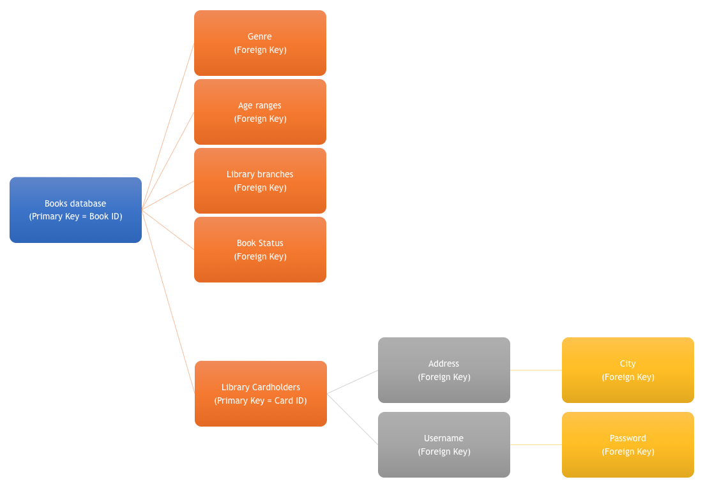

# Library Application Schema

###  The one-to-one databases

Singular customer identified to Library Card, therefore information regarding customers can only belong to one customer. 

- Cardholder – Address
- Cardholder – Username
- Address – City
- Username - Password

City is within a 1:2:1 database because it stores all the potential locations for customer addresses for greater efficiency. The foreign key from each underlying database is used for the superior level in the relationship structure. 

### One-to-Many databases

*Books database* is the single database connecting to multiple databases as it draws upon information from multiple location, including: 

- Genre
- Age ranges
- Library branches
- Book status
- Library Cardholder

This enables the following actions:

- Identification of books that are currently in stock / being borrowed

- Search for items via genre / age range

- Identification of customers that have borrowed books – therefore able to see single or multiple borrows

  

### Many-to-Many databases

Library Cardholders is a many-to-many database as it connects customer information to the books information. This enables library staff to connect books borrowed by which customer to books inventory.  

### Library Application Schema

